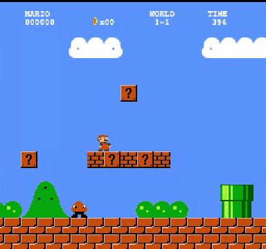
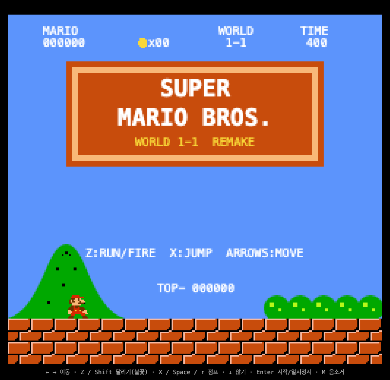
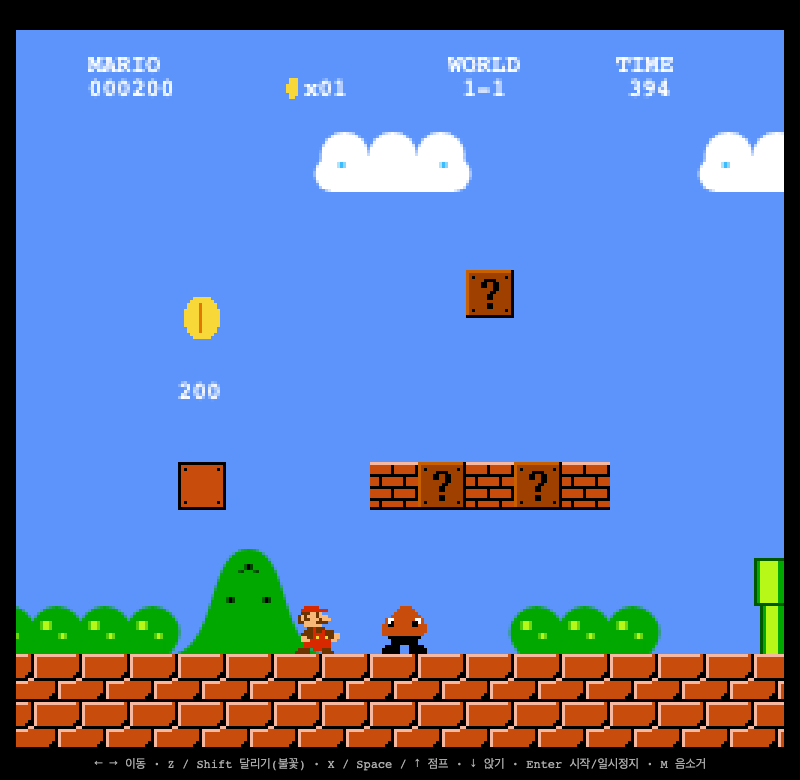

# 🍄 SUPER FABLE BROS. — World 1-1

### *One-shotted by **Claude Fable 5.1** — not 5. The point-one is the whole point.*

> **Super Mario Bros. World 1-1, remade in ONE single HTML file. Zero dependencies. Zero assets. Zero build step.**
> Every sprite, every tile, every note of the soundtrack — synthesized from raw code, by a model, in one session.

<p align="center">
  <a href="https://inonono66.github.io/fable-5.1-mario/"><b>▶️ PLAY IT RIGHT NOW</b></a>
</p>

<p align="center">
  
</p>

<p align="center">
  
  
</p>

<p align="center">
  🎬 <a href="docs/full-run.mp4">Full no-death flagpole run (mp4, 🔊 sound on)</a> — played start-to-finish by a scripted autopilot, 22,500 pts, 3 lives intact.
  <br>The chiptune you hear is 100% WebAudio oscillators — there is no audio file anywhere in this repo.
</p>

<p align="center">
  
  
  
  
  
  
</p>

---

## What is this?

The entire World 1-1 experience — the level layout, physics, enemies, power-ups,
the iconic overworld theme — packed into a single `index.html` you can open by
double-clicking. No `npm install`. No sprite sheets. No `.mp3` files. Just open it.

**One-shotted by `claude-fable-5-1` — that's Fable 5.1, mind the minor version.**
The whole game was produced by the model in a single coding session — no human wrote
a line of it. If Fable 5 was the fairy tale, 5.1 is the one that ships playable games
in one take.

## Features

- 🗺️ **Faithful 1-1 layout** — pipes, pits, staircases, the multi-coin block, hidden 1-UP energy, flagpole & castle finish
- 🏃 **Real SMB-style physics** — run momentum, skid, variable-height jumps, crouching
- 🍄 **Full power-up chain** — Small → Super → Fire Mario (yes, you can throw fireballs), Starman invincibility, 1-UP mushrooms
- 👾 **Enemies** — Goombas and Koopa Troopas, with stompable + kickable shells and combo scoring
- 🎵 **Chiptune synth engine** — the overworld theme and all SFX (coin, stomp, fireball, flagpole fanfare, hurry-up speedup at 100s) generated live with the WebAudio API. Not a single audio file
- 🎨 **Hand-encoded pixel art** — every sprite is a string-encoded bitmap rendered to canvas, palette-swapped for Fire Mario and 1-UPs
- 📱 **Touch controls** — virtual D-pad + A/B buttons appear automatically on mobile
- ⏸️ Pause, mute, lives, score, coin counter, 400-second timer — the whole HUD

## Controls

| Action | Keys |
|---|---|
| Move | `←` `→` / `A` `D` |
| Jump | `X` / `Space` / `↑` |
| Run / Fireball | `Z` / `Shift` |
| Crouch | `↓` |
| Start / Pause | `Enter` |
| Mute | `M` |

On touch devices, on-screen buttons show up on their own.

## Run it

```sh
git clone https://github.com/INONONO66/fable-5.1-mario.git
open fable-5.1-mario/index.html   # that's it. that's the build system.
```

Or just play the hosted version: **https://inonono66.github.io/fable-5.1-mario/**

## How it fits in one file

| Subsystem | How |
|---|---|
| Rendering | 256×240 `<canvas>`, integer-scaled, `image-rendering: pixelated` |
| Sprites | ASCII bitmap strings → offscreen canvases at boot, palette-swap for variants |
| Audio | Tiny sequencer over `OscillatorNode`s — square/triangle waves, note tables in MIDI numbers |
| Level | Tile map built procedurally with helpers (`pipe(x,h)`, `stairs(...)`, `q(x,y,'mush')`) |
| Physics | Fixed-timestep loop, tile-based AABB collision, NES-flavored accel/friction constants |

## 🤖 Agent Trajectory

This game was generated end-to-end by **Claude Fable 5.1** (`claude-fable-5-1`). The
full agent session trajectory — every prompt, tool call, and edit, completely
unedited — is published on Hugging Face:

> 📦 **[INONONO/fable-5.1-mario-trajectory](https://huggingface.co/datasets/INONONO/fable-5.1-mario-trajectory)**
> — raw Claude Code session log (`trajectory.jsonl`, 95 model turns / 51 user events / ~1.1 MB).
> No human wrote a line of the game; the whole prompt→tool-call→edit loop is in there.

## License

Fan-made, non-commercial educational remake. Super Mario Bros. is a trademark of
Nintendo. All original code in this repo is MIT.
